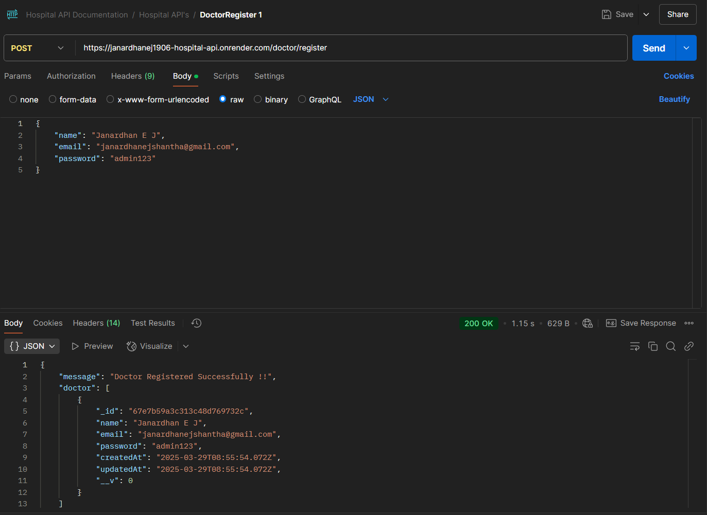
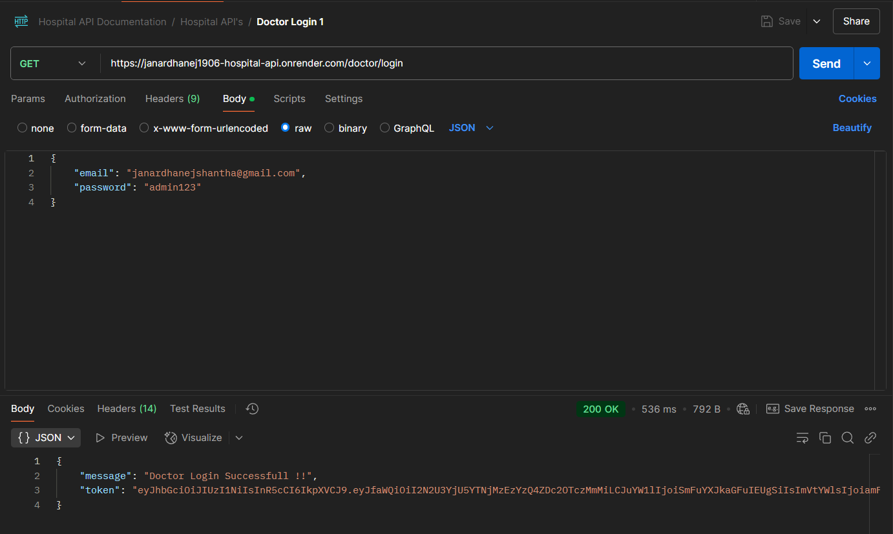
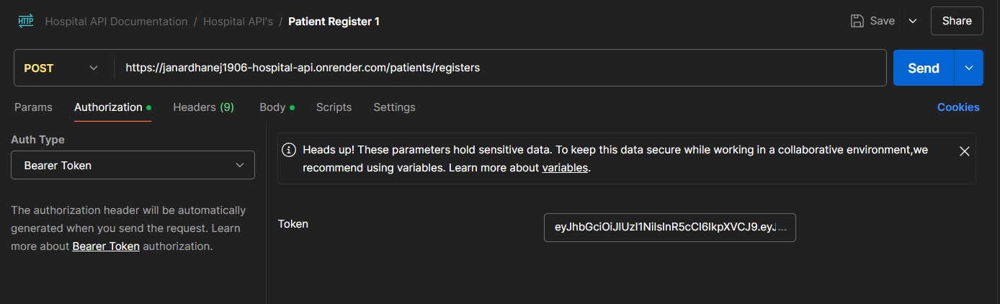
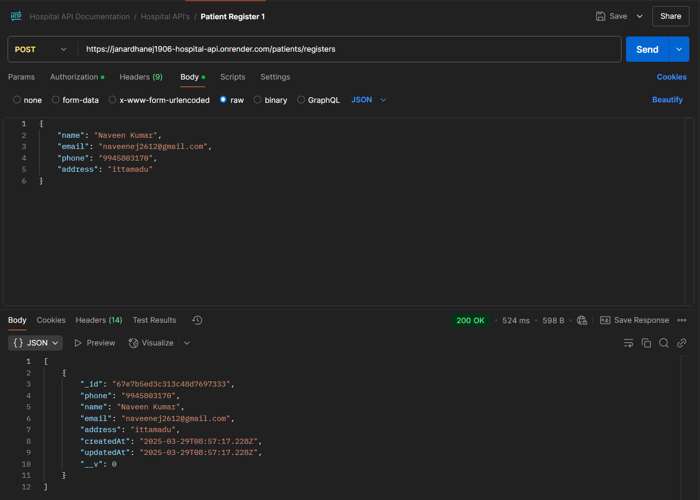
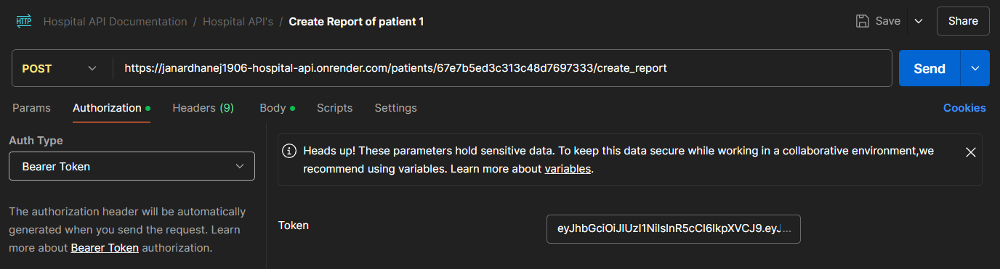
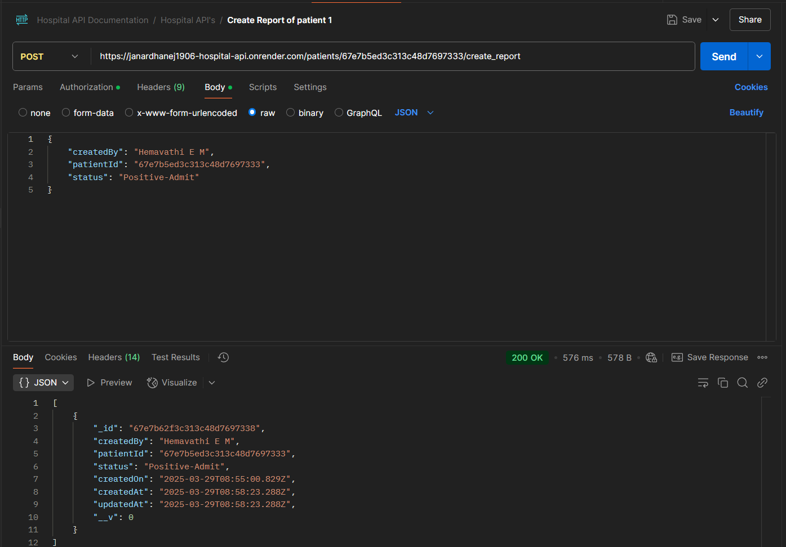
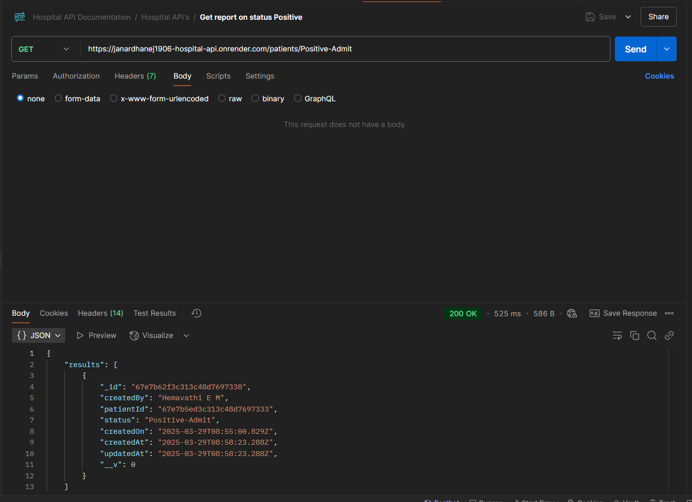
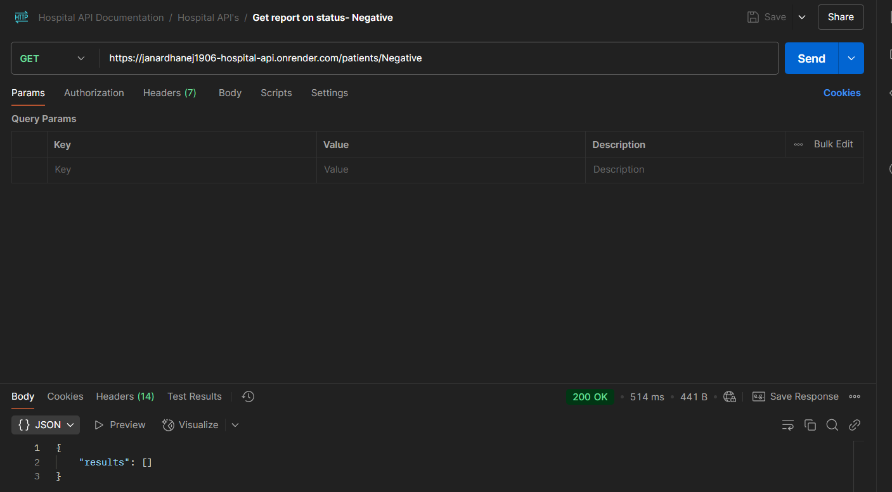
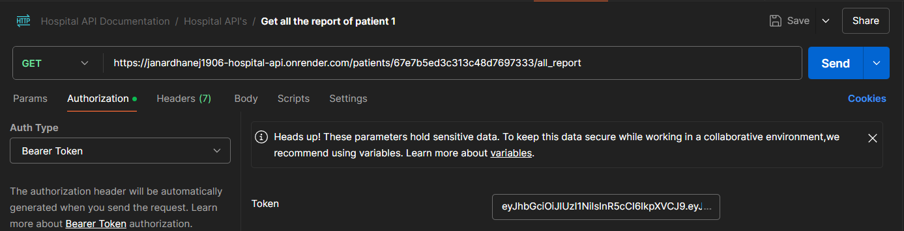
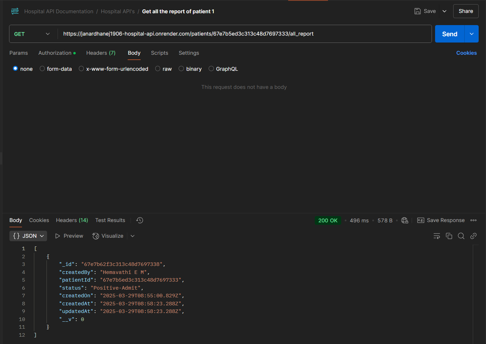

# Hospital API

The Hospital API is a Node.js and MongoDB-based backend system designed for doctors managing COVID-19 patients. Doctors can Register, Login and Create Patient Reports. Each patient can have multiple reports, categorized by status (e.g., Negative, Quarantine, Positive).


## Live Demo
Link: https://janardhanej1906-hospital-api.onrender.com


## Features Implemented

- **Doctor Registration**: Doctors can sign up using a name, email and password.

- **Doctor Login** : Secure authentication using JWT, allowing doctors to log in.

- **Patient Registration** : Patients can be registered using their phone number. If already registered, return existing patient details.

- **Create Patient Report** : After a checkup, doctors can create or generate reports with details such as doctor’s name, status and date.

- **View Patient Reports** : Retrieve all reports of a specific patient, sorted from oldest to latest.

- **Filter Reports by Status** : List all reports of all patients based on a specific status (e.g., Negative, Symptoms-Quarantine, etc.).

- **Secure Endpoints** : Protected routes using JWT authentication to ensure only authorized doctors can perform actions.


## Environment Variables

Before running the application locally, create a .env file at the root of your project and configure the following environment variables:

1. **PORT**: Port number the application will listen on.
2. **MONGO_URI**: MongoDB database connection URL String.
3. **JWT_SECRET**: A JWT secret refers to the secret key used to sign and verify JSON Web Tokens (JWTs). It plays a crucial role in ensuring the integrity and authenticity of the tokens. You can use a string like "hospitalApi" as your JWT secret. However, for better security, it should be a long, random string.

Ensure all values are correctly set before starting the application.

**Example `.env` file:**
```plaintext
PORT=3000
MONGO_URI=mongodb://localhost:27017/authdatabase
JWT_SECRET=your_jwt_Secret (eg: hospitalApi)
```


## Dependencies/technologies

The project leverages the following Node.js dependencies and technologies:
- Express.js
- MongoDB / Mongoose
- dotenv
- jsonwebtoken


## How to Use:

Follow these steps to run the project locally:
1. Clone the repository: git clone https://github.com/JanardhanEJ/janardhanej1906-Hospital-API
2. Navigate into the project directory:
   cd janardhanej1906-Hospital-API
3. Install dependencies:
   npm install
4. Start the server:
   npm start
5. Open your web browser and visit http://localhost:3000 to access the application.


## Screenshots: (taken on Render URL)
Use the URLs in Postman Application for testing: (either localhost URL/Render URL)
1. Doctor Register:


2. Doctor Login:

Save the generated token.

3. Patient Registration:
Add the generated token here:




4. Create Patient Report:
Add the generated token here:




5. Get Report on Status - Postive


6. Get Report on Status - Negative


7. Get all the reports of specific patient
Add the generated token here:



